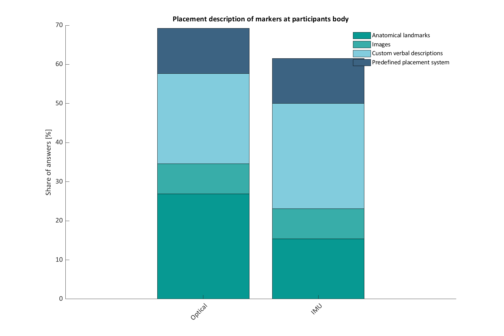

# Current development on BIDS BEP029
This is a quick update on some ongoing discussion about the BIDS extension for motion data ([BEP029](https://docs.google.com/document/d/1iaaLKgWjK5pcISD1MVxHKexB3PZWfE2aAC5HF_pCZWo/edit)). In the following we present results from a recent survey on BIDS Motion supplementing previous discussions by Stefan Appelhoff, Helena Cockx, Sein Jeung, Robert Oostenveld and Julius Welzel. The scope of the survey was to better understand the needs of the BIDS community with regard to motion data.

## Data collection
The survey was held online from late June to the end of September 2020 and distributed via Twitter and several mailing lists (e.g. FieldTrip). A total of 26 participants completed the form. 

## Moving forward
Getting things started, we encountered following questions regarding this extension which we try to answer as follows: 

### Scope of BIDS-Motion
The aim is to develop BIDS compatible standards for non-brain motion data which is usable with brain data from other BIDS formats. For the first bit of the extension, we will focus on capturing physical motion (of the human body), but keep virtual motion in mind. The survey showed, that people capturing __only__ virtual motion are exclusively from the MR community.  

### Data format
13 respondents out of 26 answered that they would find either .csv (11 votes) or .tsv (2 votes) the most useful as the raw data format. Considering that .tsv is a common alternative to .csv and more coherent with the rest of BIDS, using binary coded UTF-8 .tsv format for this BIDS extension seems to be the most favourable solution at the moment. Based on this, ongoing work on example data sets takes .tsv as the raw data format. Other datatypes mentioned in the survey (e.g.: .xdf (6), .c3d (2), .set (1)) will further be explored.

### Representational system 
24 respondents record continuous streams of position data and a majority (23) uses the Cartesian coordinate system. 21 respondents record continuous streams of orientation data. Euler angles received the most votes (16) followed by quaternions (10) as the representational system for rotations and orientations. BIDS-Motion will first address metadata requirements for unambiguous communication of Cartesian coordinates and Euler angles.   

### Data synchronization and grouping of channels
How to synchronize different types of motion data streams is one of the questions which needs more work. While this is not a motion-specific issue, it is often encountered in the context of motion research involving multiple sensors that may have varying sampling rates. Data from one group of channels sharing a nominal sampling rate can be aligned with each other by means of trimming and resampling. However, sorting data channels into meaningful groups (of sensors, trackers, or markers, etc.) is a nontrivial task. For example IMU recordings can be grouped by recording position (_grey boxes_) or by type of recording (_coloured boxes_). This will have a direct consequence on organizing the BIDS directory structure. We are currently discussing ways to allow for flexible grouping of channels on multiple levels.  

### Sensor placement
In the previous point, recording locations are mentioned. During the development of the extension we hope to provide a placement scheme which uses numeric coding or letters to define the exact placement of sensors or markers at the human body. This scheme will build upon existing ideas and be in partial agreement with the [ISPGR](https://ispgr.org/) and [MDS](https://www.movementdisorders.org/). The survey revealed a heterogenious behaviour when handling placement of sensors and markers. 

### BIDS conversion script
For converting recordings (e.g. XDF-files) we are developing a MatLab conversion script based on the [data2bids](https://www.fieldtriptoolbox.org/reference/data2bids/) example. This should help to directly convert motion capture recordings to BIDS structure.

### Timeline
For the rest of the year, we plan to provide a ontology about motion capture in confirmation with current BIDS and to solve the grouping issue of recording. By _roughly_ mid 2021 we hope to have developed a first draft of the Google-Doc. We are happy about contributions from within and outside the BIDS community.
